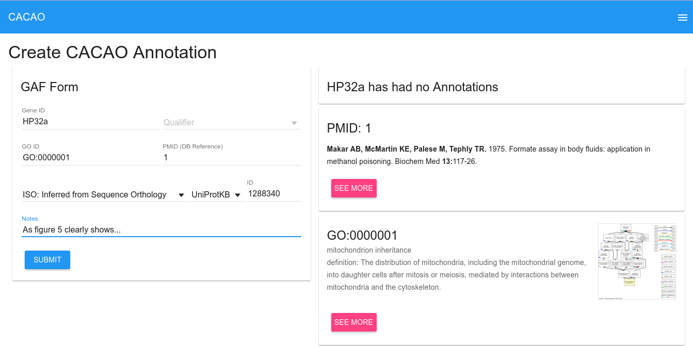

# CACAO Frontend 

An easy to use AngularJS application for making GO annotations to genes. The
service also includes many competition and judging features that are
appropriate to running a CACAO course.

